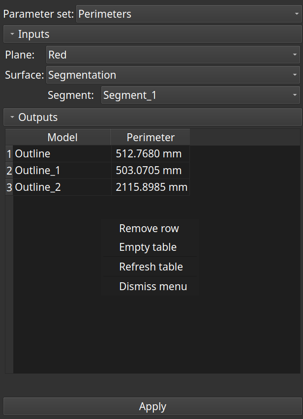

# Perimeters

This module creates a cross-section a closed surface and calculates the perimeter of each connected region.

### Usage

Select

 - a slice view node or a markups plane node
 - a model node or a segmentation node

and apply.

A model of each connected region is created and its perimeter is calculated. The result is displayed in a table that is not saved with the scene.

Changing the name of the model in the table updates the node's name.

Removing a row of the table removes the model from scene.

Clicking in a cell of the 'Perimeter' column toggles the visibility of the model.

When a scene is loaded from storage, the perimeters of the saved outline models can be calculated at once with the 'Refresh table' menu item.

### Notes

If a perimeter cannot be calculated (-1.0), switch to 'Surface net' smoothing method in the segment editor.

### Disclaimer

Use at your own risks.
